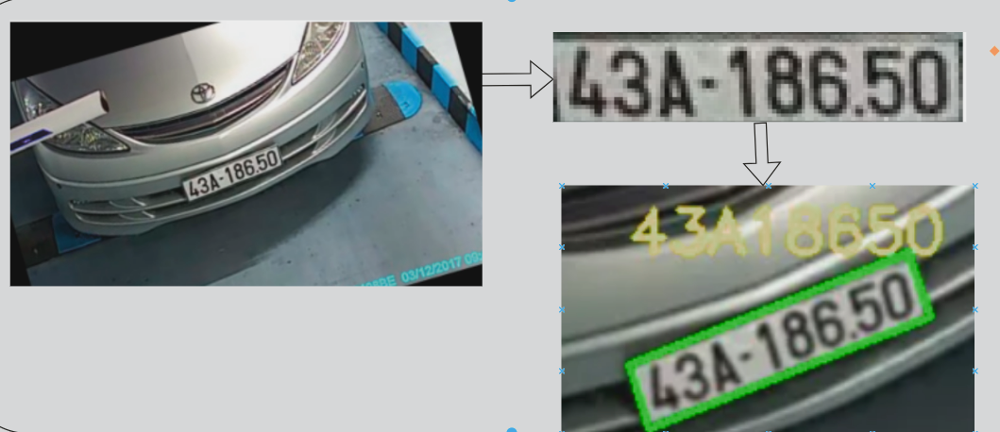
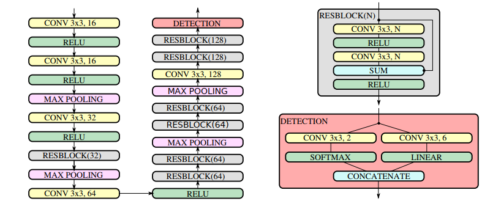
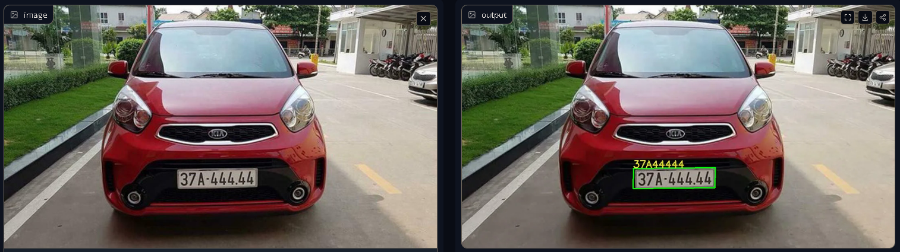
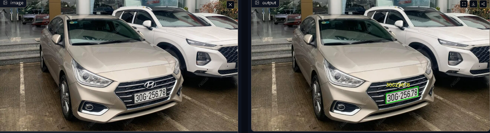

# Project name

Licenseplate recognition using WPOD and PARSeq.

## 1.Overview

This is a two-stage license plate recognition model consisting of license plate detection and character recognition.WPOD - Warped Planar Object Detection Network is used to detect the license plate region, returning a quadrilateral bounding box around the plate and transforming it into a front-facing view.After that, the PARSeq model is used to recognize the characters on the license plate.The model performs well and achieves an accuracy of 95% on the test set.

## 2.Code structure

- `wpod` : Folder contains wpod model
- `parseq` : Folder contains parseq model
- `app.py` : Script for application

## 3.Model architecture.

## 4.Demo
You can run script app.py or follow this [link](https://huggingface.co/spaces/windy2612/License_Plate_Recognition) to access the application.

There are some illustrations of my repo.

## 5.Reference
[wpod model](https://github.com/Pandede/WPODNet-Pytorch)
[parseq model](https://github.com/baudm/parseq)